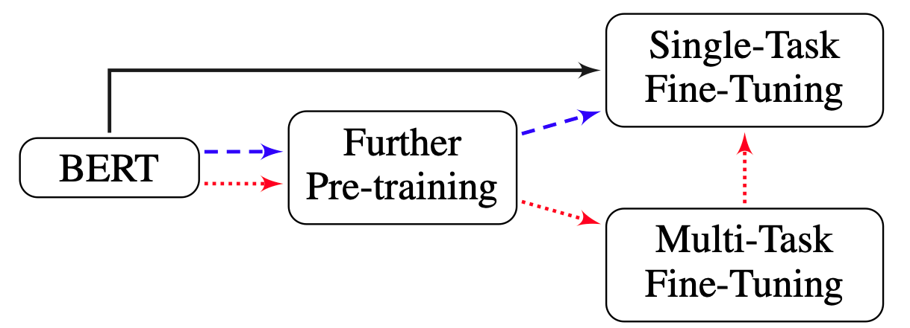

# Commonlit Readability Prize

The [Kaggle Commonlit Competition](https://www.kaggle.com/c/commonlitreadabilityprize/) asked: *Can machine learning identify the appropriate reading level of a passage of text, and help inspire learning*? 

Reading is an essential skill for academic success. When students have access to engaging passages offering the right level of challenge, they naturally develop reading skills.

The Coleridge Initiative is a not-for-profit that has been established to use data for social good. One way in which the organization does this is by furthering science through publicly available research.

For this competition, we were to rate the complexity of reading passages for grade 3-12 classroom use. We were given a dataset that includes readers from a wide variety of age groups and a large collection of texts taken from various domains.

## Approach

We used a simple ensemble of different pretrained and subsequenetly fine-tuned Transformers. We trained multiple different architectures, such as roberta-base (Liu et. al., 2019) and deberta-large (He et. al., 2020), and also used multiple different training regimes and external reading comprehension datasets.

Following the recommendations in Sun, Chi, et al. on "How to fine-tune bert for text classification", we experimented with different regimes of pretraining and finetuning. The picture, taken from their paper, outlines with different colored paths, different approaches that can be taken to fine-tune transformer models on a task.

We used five different external datasets in particular (outside of the task dataset):

1. CK12 csv (custom dataset based on a scrape of the ck12 science textbook websites)
2. Weebit
3. Simple Wiki
4. OneStop English
5. HighSchool RACE

For each dataset, we adapted the loss function separately based on how the labels were constucted. For instance, the HighSchool RACE dataset gives us text that are either elementary, middle-school, or highschool. So we can adapt this dataset to predict these three labels in a regression setting. 

Other datasets such as the Simple Wiki contained an alignment between hard and easy texts. To take advantage of this feature, we used a constrative loss where we try to predict which of two texts (selected from either simple or normal wiki) is the most complex.

We also extracted reading statistics on the texts, such as Flesch Reading Ease and Gunning Fog, to use as additional inputs to the networks.

## Results

Pretraining and fine-tuning using a multitask approach seemed to work best on the task at hand for a single model, and formed the basis of our final solution.

Unfortunately due to both time and resource constraints were unable to do large parameter searches and ensembles, which was the crux of this particular competition. 

Additionaly, the winning solution used pseudo-labeling, which we failed to explore but will be sure to in the future 😅.

We finished in 263rd position out of 3633 teams.

## References

> He, Pengcheng, et al. "Deberta: Decoding-enhanced bert with disentangled attention." *arXiv preprint arXiv:2006.03654* (2020).

> Liu, Yinhan, et al. "Roberta: A robustly optimized bert pretraining approach." *arXiv preprint arXiv:1907.11692* (2019).

> Sun, Chi, et al. "How to fine-tune bert for text classification?." *China National Conference on Chinese Computational Linguistics*. Springer, Cham, 2019.

